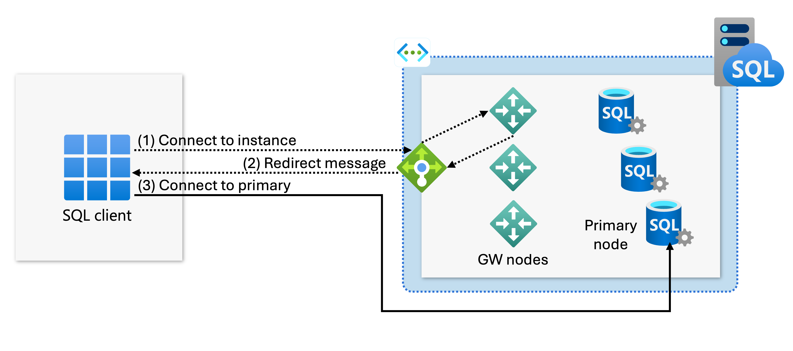
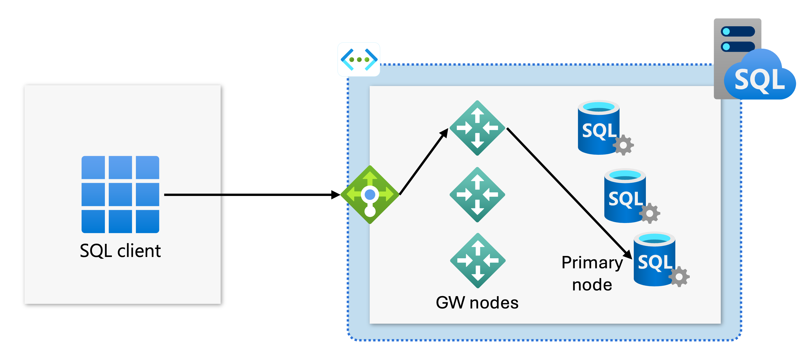

# Azure SQL Managed Instance connection types

[!INCLUDE [appliesto-sqlmi](../includes/appliesto-sqlmi.md)]

This article explains the different connection types available to VNet-local endpoints for [Azure SQL Managed Instance](sql-managed-instance-paas-overview.md) and how to configure them.

## Connection types

The VNet-local endpoint of Azure SQL Managed Instance supports two connection types: *redirect* (default) and *proxy* (legacy).

### Redirect connection type (default)

Starting in October 2025, the redirect connection type is the default and preferred way for SQL clients to connect to Azure SQL Managed Instance. With redirect, SQL clients establish connections directly to the node that hosts the database. The redirect connection type has better latency and throughput performance compared to the legacy proxy connection type. Redirect also minimizes the disruption of planned maintenance events of the gateway component, since redirect connections, once established, have no dependency on the gateway.

The benefits of the redirect connection type are only available for SQL clients that support TDS version 7.4 or newer, which was released with SQL Server 2012. Older clients can still connect through redirect, but are routed through the less performant proxy connection type. SQL drivers available with SQL Server 2012 and later make full use of the redirect connection type. For a list of recommended TDS drivers, see [Recommended versions of drivers and tools](connect-application-instance.md#recommended-versions-of-drivers-and-tools).

To use the redirect connection type, you need the following prerequisites:

- Traffic from your SQL clients to the SQL managed instance must be permitted on port 1433 across the instance's subnet address range. Make sure that the subnet's inbound Network Security Group (NSG) rules, SQL client host's outbound rules, and any network appliances along the network path allow the client to reach the entire subnet range.
- SQL clients must be able to resolve domain names within the SQL managed instance's `<dns-zone>.database.windows.net` domain as defined in Azure DNS.

In the redirect connection type, after the TCP session is established to the SQL Server Database Engine, the client session obtains the destination virtual IP address of the virtual cluster node from the load balancer. Subsequent packets flow directly to the virtual cluster node, bypassing the gateway. The following diagram illustrates this traffic flow:



### Proxy connection type (legacy)

Proxy is a legacy connectivity mechanism that trades performance for strict compatibility with TDS drivers older than 7.4. This connection type proxies the incoming connections through an internal gateway. Because the internal gateway forwards the connection, proxy connections can create connectivity bottlenecks that severely degrade latency and lower throughput compared to the redirect connection type. Additionally, the proxy connection type generates more disconnect events due to planned maintenance events of the gateway component.

You should only use the explicit proxy connection type while debugging connectivity issues or when attempting to connect using a custom driver that doesn't follow the current TDS standard. Under regular circumstances, the redirect connection mode automatically takes older SQL clients through the proxy connection path.

The following diagram illustrates the proxy TCP flow via the gateway:



### "Default" connection type 

The value of the `proxyOverride=Default` is deprecated, as it now functions as an alias for the redirect connection type. Starting in October 2025, when you deploy or update a SQL managed instance programatically (by using the REST API, Azure CLI, or PowerShell), and set the `proxyOverride` parameter to `Default`, the value is interpreted as `Redirect`. The value of `Default` itself is never preserved in the properties of the SQL managed instance. As such, 24 hours after setting `proxyOverride` to `Default`, a subsequent request to get the details of the SQL managed instance reveals that the value of the `proxyOverride` parameter is `Redirect`.

> [!NOTE]
> SQL managed instances with the `proxyOverride` value set to `Default` before October 2025 are converted to `Proxy`.

## Change the connection type

- **Using the Azure portal:**
To change the connection type by using the Azure portal, go to the **Networking** section for your SQL managed instance, change the **Connection type** setting and save the changes.

- **Script to change connection type settings using PowerShell:**

The following PowerShell script shows how to change the connection type for a SQL managed instance to `Redirect`.

```powershell
Install-Module -Name Az
Import-Module Az.Accounts
Import-Module Az.Sql

Connect-AzAccount
# Get your SubscriptionId from the Get-AzSubscription command
Get-AzSubscription
# Use your SubscriptionId in place of {subscription-id}
Select-AzSubscription -SubscriptionId {subscription-id}
# Replace {rg-name} with the resource group for your SQL managed instance, and replace {mi-name} with the name of your SQL managed instance
$mi = Get-AzSqlInstance -ResourceGroupName {rg-name} -Name {mi-name}
$mi = $mi | Set-AzSqlInstance -ProxyOverride "Redirect" -force
```

## Related content

- Learn how to set up [private endpoints to your SQL managed instances](private-endpoint-overview.md)
- Learn how to [configure a public endpoint on SQL Managed Instance](public-endpoint-configure.md)
- Learn about [SQL Managed Instance connectivity architecture](connectivity-architecture-overview.md)